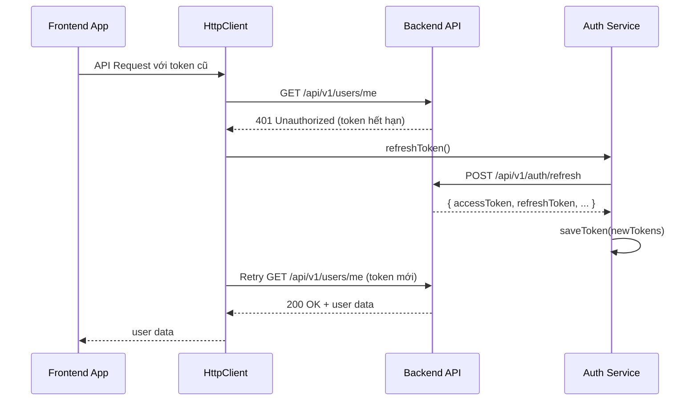

# 🔄 Token Refresh Guide

## Overview
Hệ thống đã được cập nhật với cơ chế tự động refresh token khi token hết hạn. Khi gọi API và gặp lỗi 401 (Unauthorized), hệ thống sẽ tự động:

1. ✅ Gọi API refresh token với refresh token hiện có
2. ✅ Lưu access token và refresh token mới
3. ✅ Retry lại request ban đầu với token mới
4. ✅ Đăng xuất user nếu refresh token cũng hết hạn

---

## 🏗️ Cấu trúc mới

### 1. **HttpClient** (`src/services/httpClient.ts`)
- Axios instance với interceptors tự động xử lý token
- Queue system cho các request đồng thời khi refresh token
- Auto logout khi refresh token thất bại

### 2. **DbdocsApiService** (`src/services/dbdocsApiService.ts`) 
- Service layer sử dụng HttpClient
- Tất cả API calls tự động có cơ chế refresh token
- Type-safe interfaces cho User, Project, Documentation

### 3. **Updated AuthService** (`src/services/authService.ts`)
- Thêm method `refreshAccessToken()`
- Hỗ trợ lưu và lấy refresh token
- Cập nhật `fetchUserInfo()` sử dụng httpClient

---

## 🚀 Cách sử dụng

### 1. **Sử dụng DbdocsApiService (Khuyến nghị)**
```typescript
import dbdocsApiService from '../services/dbdocsApiService';

// Tất cả API calls này đều có auto refresh token
const user = await dbdocsApiService.getCurrentUser();
const projects = await dbdocsApiService.getProjects();
const docs = await dbdocsApiService.getDocumentations();
```

### 2. **Sử dụng HttpClient trực tiếp**
```typescript
import httpClient from '../services/httpClient';

// Auto refresh token cho mọi request
const response = await httpClient.get('/api/v1/custom-endpoint');
const data = await httpClient.post('/api/v1/data', { payload });
```

### 3. **Migration từ fetch/axios cũ**

❌ **TRƯỚC (không có auto refresh):**
```typescript
const response = await fetch('/api/v1/users/me', {
  headers: {
    'Authorization': `Bearer ${token}`
  }
});
```

✅ **SAU (có auto refresh):**
```typescript
const user = await dbdocsApiService.getCurrentUser();
// hoặc
const response = await httpClient.get('/api/v1/users/me');
```

---

## 🔧 Flow hoạt động



---

## ⚙️ Backend API Requirements

### Refresh Token Endpoint
```http
POST /api/v1/auth/refresh
Content-Type: application/json

{
  "refreshToken": "eyJhbGciOiJIUzI1NiJ9..."
}
```

### Response Format
```json
{
  "accessToken": "eyJhbGciOiJIUzI1NiJ9...",
  "refreshToken": "eyJhbGciOiJIUzI1NiJ9...",
  "tokenType": "Bearer",
  "expiresIn": 86400000
}
```

---

## 🛡️ Error Handling

### Token Refresh Success
- ✅ Request tiếp tục với token mới
- ✅ Không có interruption cho user

### Token Refresh Failure
- ❌ Auto logout user
- ❌ Redirect về login page
- ❌ Clear all tokens từ localStorage

### Multiple Concurrent Requests
- ✅ Queue system - chỉ refresh token một lần
- ✅ Tất cả pending requests đều dùng token mới

---

## 📋 Migration Checklist

### ✅ Completed
- [x] HttpClient với auto refresh interceptor
- [x] DbdocsApiService với type-safe APIs
- [x] AuthService với refreshAccessToken method
- [x] AuthCallback xử lý refresh token từ backend
- [x] Documentation và guide

### 🔄 TODO (Optional)
- [ ] Migrate existing API calls sang dbdocsApiService
- [ ] Add retry logic cho network errors
- [ ] Add request/response logging trong development
- [ ] Add rate limiting cho refresh requests

---

## 🐛 Troubleshooting

### 1. **Infinite refresh loop**
- Kiểm tra backend refresh token endpoint
- Đảm bảo backend trả về format đúng

### 2. **User bị logout liên tục**
- Kiểm tra refresh token expiry time
- Kiểm tra backend validate refresh token

### 3. **API calls thất bại**
- Kiểm tra baseURL trong httpClient
- Kiểm tra network connectivity
- Check console logs để debug

---

## 💡 Best Practices

1. **Luôn sử dụng dbdocsApiService** cho API calls thay vì fetch/axios trực tiếp
2. **Không handle 401 manually** - để HttpClient tự động xử lý
3. **Kiểm tra network errors** - refresh token chỉ handle 401
4. **Test với token hết hạn** để đảm bảo flow hoạt động đúng
5. **Monitor console logs** để debug refresh token flow

---

## 🎯 Example Usage trong Components

```typescript
import React, { useState, useEffect } from 'react';
import dbdocsApiService, { User } from '../services/dbdocsApiService';

const UserProfile: React.FC = () => {
  const [user, setUser] = useState<User | null>(null);
  const [loading, setLoading] = useState(true);

  useEffect(() => {
    const fetchUser = async () => {
      try {
        // Auto refresh token nếu cần
        const userData = await dbdocsApiService.getCurrentUser();
        setUser(userData);
      } catch (error) {
        console.error('Failed to fetch user:', error);
        // User sẽ được auto logout nếu refresh token thất bại
      } finally {
        setLoading(false);
      }
    };

    fetchUser();
  }, []);

  if (loading) return <div>Loading...</div>;
  if (!user) return <div>Please login</div>;

  return (
    <div>
      <h1>Welcome {user.name}!</h1>
      <p>Email: {user.email}</p>
    </div>
  );
};

export default UserProfile;
```

Hệ thống token refresh đã sẵn sàng sử dụng! 🚀 